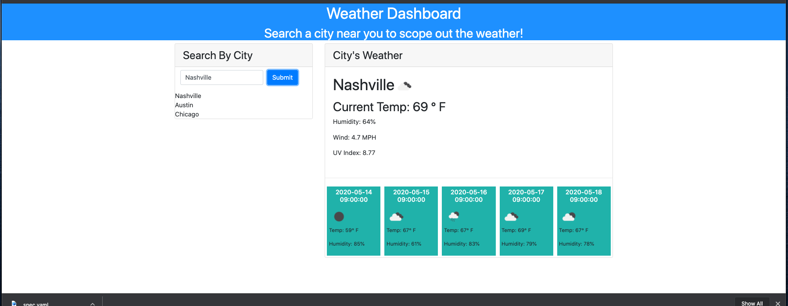

WEATHER DASHBOARD APP

This weather Dashboard uses OpenWeather API to retrieve weiather data for cities search by the user. The dashboard provides current weather information as well as a 5-day forecast, which are dynamically updated. 

 [functioning app website](https://ashleydeyoung.github.io/weatherdashboard/)

